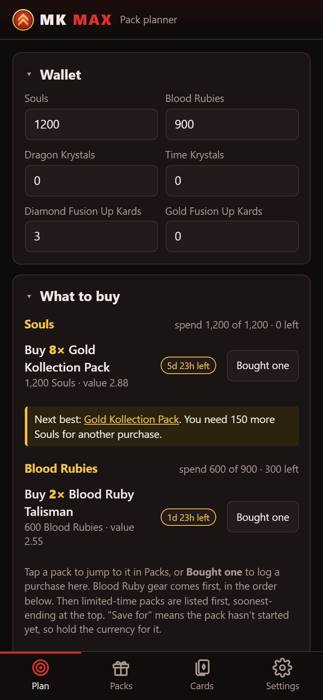
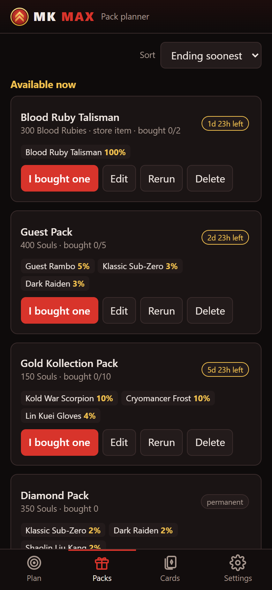
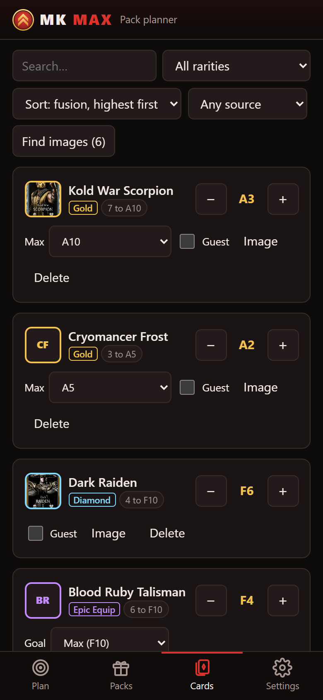

# MK Max

**A pack planner for Mortal Kombat Mobile.** Tell it which cards you're maxing, what's in the store and how much currency you have, and it works out which packs to buy, in what order, and where your Fusion Up Kards should go.

**[Open the app →](https://simba3696.github.io/mkmax/)** It runs in any modern browser. Add it to your home screen to use it like a native app, offline included.

[](https://github.com/Simba3696/mkmax/actions/workflows/deploy.yml)
[](LICENSE)

<p align="center">
  
  
  
</p>

## Features

- **Purchase plan.** For each currency (Souls, Blood Rubies, Dragon Krystals, Time Krystals, or any you add) it recommends what to buy, putting limited-time packs first, and tells you when to save for a pack that hasn't started yet. Tap a pack to jump to it, or log a purchase without leaving the plan. With a daily income set, it says when you'll afford what it's saving for.
- **Pack ranking.** Compares packs by expected value per cost, showing your chance of each card you need per buy and about how many buys a copy takes.
- **Fusion Up Kard plan.** Spends kards on the cheapest steps first, by rarity, through ascension for Gold cards.
- **Blood Ruby gear order.** Maxes the Realm Klash gear one piece at a time, in an order you choose, before any other Blood Ruby buy, and forecasts the date each piece and the whole set will be maxed.
- **Ending-soon badge.** The Packs tab, and the home-screen icon where the phone supports it, counts planned packs that end within a day.
- **Live shop schedule.** Packs on sale or coming up, Elder challenge dates and Realm Klash season ends come from [MK Mobile Base](https://mkmobilebase.com/) and are refreshed daily.
- **Card art and rarities.** Looked up automatically from MK Mobile Base and the [MK Mobile wiki](https://mortalkombat-mobile.fandom.com/).
- **Quick entry.** Paste a whole card list, split even-pool odds across cards in one go, and log a purchase with one tap. Undo works on all of these. Sort packs by end time or currency and cards by rarity, fusion level or name, and fold away Plan cards you don't need.
- **Private by default.** Your data stays in your browser. Optional sync between devices uses a secret GitHub Gist that you own.

## How it decides

Every copy of a card gets a value based on where it takes the card: unlocking it, reaching F3 (where Fusion Up Kards start to work), normal fusion, or steps your kards would cover anyway. Guest cards get extra weight, and Kameos and Elder challenge Kameos get less. A pack's value is the expected value of its drops. The planner keeps buying the affordable pack with the best value per cost, updating your expected progress after each buy so repeat buys count for less. Every weight and fusion cost can be edited in Settings.

The full model is in [How it works](docs/how-it-works.md).

## Documentation

- [User guide](docs/user-guide.md): getting started, everyday use, sync, and what's tracked for each rarity
- [How it works](docs/how-it-works.md): scoring, the event schedule, and where card images come from
- [Development](docs/development.md): setup, project layout, migrations, hosting

## Quick start

```sh
npm install
npm run dev     # http://localhost:5173
npm test
npm run lint
npm run build   # installable PWA in dist/
```

Built with React 19, TypeScript, Vite and `vite-plugin-pwa`, linted with oxlint and tested with Vitest. Pushes to `main` deploy to GitHub Pages through GitHub Actions.

## License

[MIT](LICENSE).

## Credits

Card art, rarities and the event schedule come from [MK Mobile Base](https://mkmobilebase.com/), which mirrors [mkmobileevent.com](https://mkmobileevent.com). The wiki fallback uses the [MK Mobile wiki](https://mortalkombat-mobile.fandom.com/). Images aren't copied into this repo; they're loaded from those sites.

MK Max is an unofficial fan project and isn't affiliated with or endorsed by Warner Bros. Games or NetherRealm Studios. Mortal Kombat and all related names and art are trademarks of their owners.
