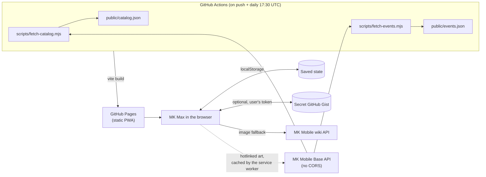
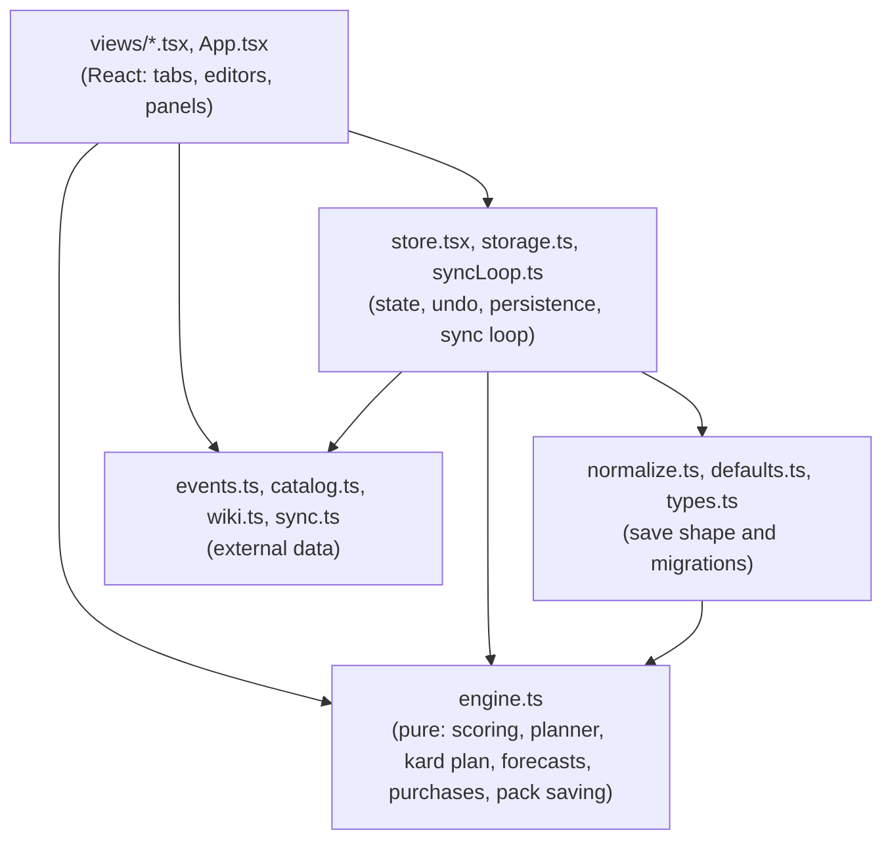
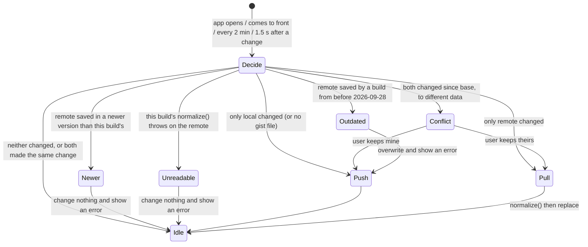

# Architecture

How MK Max is put together and why. For the scoring maths, see [How it works](how-it-works.md). For setup and the file-by-file layout, see [Development](development.md).

## System context

MK Max is a static, client-only PWA. There's no backend: everything the app knows lives in the browser, and the only network calls at runtime are to GitHub (optional sync) and the MK Mobile wiki (an image fallback).

Two constraints shape this:

- **MK Mobile Base doesn't allow cross-origin requests**, so the browser can't call it. CI fetches the catalog and the event schedule at build time and ships them as static JSON. When the site is down or its data looks wrong, the deploy ships the copies that are live again, or the committed ones if those can't be downloaded. The schedule script also reads the live `events.json` to keep Realm Klash weeks the site has dropped.
- **No server to run or pay for.** Personal data stays on the device; sync goes through a gist the user owns, using their own token.

## Layers

- **`engine.ts` is plain TypeScript with no React and no I/O.** It takes an `AppState` and a `now` and returns plans. That's what makes the planner unit-testable (`engine.test.ts` is the biggest test file) and lets scripts reuse it. Keep it that way: anything that needs the clock, the network or the DOM belongs in a view, the store or an `Ext` module, and gets passed in. It also holds the rules views apply when they change data, like logging a purchase (`recordPurchase`) and saving a pack from the editor (`editedPack`, `packEndOnSave`, `editorSeasonEnd`, `seasonMoveOnSave`, `savePack`, `addPool`), so those are tested too. The editor works on a copy of the pack, so `editedPack` lays its changes over the pack as it is when saved: Already bought and the end date keep a purchase or season move that landed meanwhile.
- **`store.tsx` owns the single `AppState`.** Every change goes through `update(recipe, undoLabel?)`, which clones the state, applies the recipe, removes finished cards (`pruneDone`), stamps `updatedAt` (with `SyncLoop.nextStamp`, so the stamp is always after this device's last one and the last agreed one, whatever the clock says), saves to localStorage and schedules a sync push. Changes the app makes by itself that every device derives the same way (catalog art) pass `{ auto: true }`, which saves them without stamping or pushing, so they can't cause sync conflicts. The season-end move from the schedule is a normal change, since which packs it moves depends on when it runs, except on a fresh install (no stamp, no packs): stamping that would make a new device's first sync a conflict instead of a pull. It waits for `sync.settled` (this launch's first sync attempt has finished, whatever the outcome) so it usually runs on the other devices' latest data.
- **Views derive everything else on render**: `buildCtx(state)` then `buildPlan(ctx, now)`. Nothing derived is stored, so there's no cache to invalidate.

## State model

One JSON document, `AppState` in `types.ts`: rarities (fusion and kard tables), currencies, cards, packs, weights, and a few lists (gear order, dismissed shop packs). It's saved whole to localStorage under `mkmax:v1` and synced whole to the gist. If that save can't be read at startup, `load()` in `storage.ts` copies it to `mkmax:v1:unreadable` before the fresh state is saved over it, and resets the sync `baseUpdatedAt` to 0 so the first sync pulls the gist's copy rather than counting the empty state as agreed. Settings → Data offers the copy as a download until the user discards it.

Decisions worth knowing:

- **Finished cards are deleted, not archived.** Reaching a goal removes the card, its drop entries and any store item that only sold it. Undo is the safety net. The app is a to-do list for maxing, not a collection record.
- **Levels are stored as copy counts**: 0 = not owned, 1 = F0, 11 = F10, then ascension. `levelLabel` turns them into F/A labels. Version 1 stored F1 as the first copy, which is why `migrateV1` exists.
- **Every load goes through `normalize()`**: localStorage, imports and sync pulls. It runs each migration once, by `version`, so a later user edit (deleting a rarity, removing a tag) sticks. See [Development → Saved data and migrations](development.md#saved-data-and-migrations).
- **Per-device settings aren't in `AppState`.** Sort orders, folded cards and the sync token live in their own localStorage keys (`mkmax:cardSort`, `mkmax:packSort`, `mkmax:folded`, `mkmax:sync`), so they never sync or get exported.

## Planner (LLD)

`buildPlan` in `engine.ts`, run once per render of the Plan:

1. **Kard allocation** (`allocateKards`, inside `buildCtx`). For each rarity, spend its Fusion Up Kards one step at a time on the step with the best `cardWeight / kardCost`, tie-breaking on the card with the fewest steps left to its goal. Realm Klash gear is excluded. The result is how many copies kards will supply per card, which the next step treats as worth less.
2. **Copy value** (`copyValue`). The `g`-th extra copy of a card falls into a phase (unlock, to F3, normal, covered by kards, maxed) with its own multiplier, times the card's weight (guest, Kameo, challenge), times a closeness bonus. `gainValue` integrates this over fractional expected copies.
3. **Blood Ruby gear first.** For Blood Rubies only, walk `gearQueue` in order and buy each piece's cheapest store item until the piece is maxed. If the next copy isn't affordable, stop and save for it; nothing else is bought with rubies.
4. **Greedy per currency.** Repeatedly buy the affordable pack with the best `packEV / cost` (times `limitedBoost` if it has an end date), adding its expected copies to a shared `gained` map so later buys, in any currency, see diminishing returns. Stop when nothing affordable has positive value. The best pack you can't afford becomes `saveFor`.
5. **Forecasts** (`daysToAfford`, `gearForecast`) divide shortfalls by the currency's `perDay`.

Greedy-by-ratio isn't optimal for a knapsack in general, but purchases are small next to balances, values are estimates anyway, and the result is explainable to the user line by line. That trade is deliberate.

## Sync

The loop itself is `SyncLoop` in `syncLoop.ts`, plain TypeScript with GitHub, the state and timers passed in; `store.tsx` wires it to React. `decideSync` in `sync.ts` compares each side's `updatedAt` with `baseUpdatedAt`, the stamp both last agreed on. When both sides moved but hold the same data apart from the stamp (each device moved the season end by itself), `sameData` makes it a no-op and both stamps count as agreed. While a conflict waits for the user, background syncs hold off, and a sync that ends in a conflict or an error doesn't reschedule itself; the regular pulls retry. Keeping this device's copy first re-reads the gist: if the other device pushed again while the prompt was up, the prompt shows that copy instead. Otherwise it restamps the kept copy above both copies (the outdated branch does the same), so the other device pulls it, or asks if it has changed since, rather than overwriting it with its own next edit. Data saved in a newer version than this build's is neither pulled nor pushed (an app left open across a deploy would otherwise save it back in its older format and drop fields, and the newer build would then rerun one-time migrations over the user's later changes); the loop shows an error and leaves the update to pull to refresh or a reopen, since finding it reloads the page. Import backup refuses such a file too. The same goes for a gist copy this build's `normalize()` throws on (`canRead`): pulling it would fail, and pushing or asking would let a device whose own save couldn't be read upload its fresh data over it, so the loop shows an error and waits for an update. If applying the gist's copy fails after Keep theirs anyway, it shows that error rather than leaving a prompt whose buttons do nothing. Edits are stamped with `nextStamp`, after both this device's own stamp and `baseUpdatedAt`: after a pull, the agreed stamp comes from the other device's clock, and a device whose clock runs behind would otherwise stamp its edits as older than it and never push them. A sync that finishes after the user disconnected changes nothing. It's last-writer-wins with conflict detection, not a merge: the data is small and edited by one person, so asking which copy to keep is simpler and safer than merging fields.

## Offline and updates

`vite-plugin-pwa` precaches the app shell. `main.tsx` asks for persistent storage (`navigator.storage.persist()`) at startup, since without sync localStorage is the only copy of the data and browsers may clear it. `events.json` is network-first (it changes daily), falling back to the cached copy after 4 seconds on a connection that hangs, and card art from MK Mobile Base and the wiki is cache-first for 90 days. The build stamps the short commit id and commit date into `__APP_VERSION__`, shown at the bottom of Settings. It's the commit date, not the build date, so the daily scheduled deploy, which rebuilds the same commit with new `events.json` and `catalog.json` (neither precached), builds identical app files: the service worker doesn't change and no device downloads the app again or reloads. Pull to refresh checks for a new service worker and reloads into it. A new worker activates as soon as it's found, but `appUpdate.ts` holds the reload while a `[data-modal]` pop-up or the `[data-undo]` Undo bar is up and reloads once both are gone, so an update found just after launch can't throw away a half-entered pack or the Undo for saving it.

## Styling and layout

Styles are Tailwind CSS v4 utilities, built at compile time by `@tailwindcss/vite`, so there's no runtime styling dependency. `src/styles.css` holds the theme tokens (`@theme`, with Tailwind's default palette removed so only the app's colors exist) and the base control styles. Shared class sets are in `src/classes.ts`. Each set owns its properties, so nothing should add a second utility for the same property on the same element at the same breakpoint.

`App.tsx` has one layout that changes at `md` (768px). Below it, a header, a 720px page column and a bottom tab bar, which is the phone design and must stay as it is. From `md`, a left rail (88px, 220px from `lg`) replaces the header and tab bar, the page grows to 1400px, and views add columns. The rail is moved with `order-first` rather than in the DOM, so keyboard and screen reader order don't change. Only `<main data-scroll-root>` scrolls; pop-ups are portalled to `<body>` with `data-modal`, and `Modal` makes `#root` inert while one is open and gives focus back to the opener when it closes. `scrollRoot.ts`, `PullToRefresh` and `useSwipeTabs` find these by attribute, so restyling can't break them.

## Testing

Vitest covers the pure modules: the engine, migrations via `normalize`, sync decisions, the sync loop (two devices against a fake gist, with requests held open to edit or disconnect mid-sync), the list parser, catalog and event name matching, and the schedule script's parsing and season carry-over (`scripts/schedule.test.mjs`). Views have no tests; they're thin over the engine and are checked by running the app. CI runs lint and tests before every deploy.
