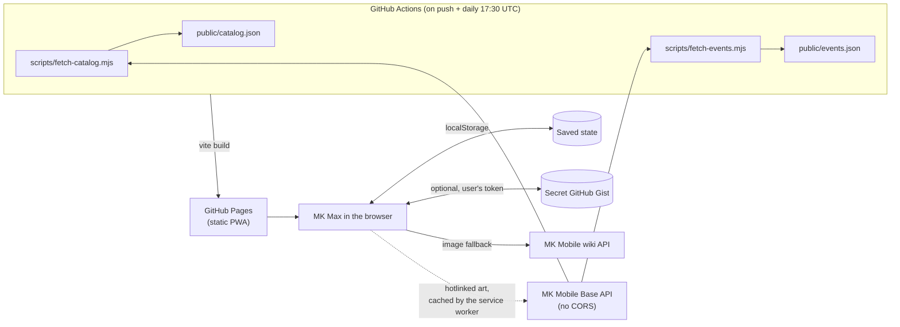
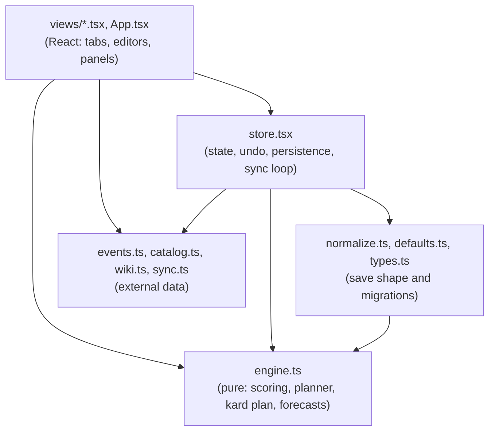
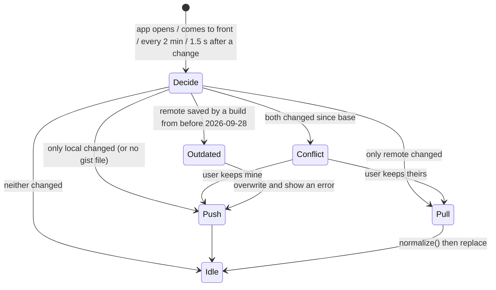

# Architecture

How MK Max is put together and why. For the scoring maths, see [How it works](how-it-works.md). For setup and the file-by-file layout, see [Development](development.md).

## System context

MK Max is a static, client-only PWA. There's no backend: everything the app knows lives in the browser, and the only network calls at runtime are to GitHub (optional sync) and the MK Mobile wiki (an image fallback).

Two constraints shape this:

- **MK Mobile Base doesn't allow cross-origin requests**, so the browser can't call it. CI fetches the catalog and the event schedule at build time and ships them as static JSON. The committed copies are the fallback when the site is down.
- **No server to run or pay for.** Personal data stays on the device; sync goes through a gist the user owns, using their own token.

## Layers

- **`engine.ts` is plain TypeScript with no React and no I/O.** It takes an `AppState` and a `now` and returns plans. That's what makes the planner unit-testable (`engine.test.ts` is the biggest test file) and lets scripts reuse it. Keep it that way: anything that needs the clock, the network or the DOM belongs in a view, the store or an `Ext` module, and gets passed in.
- **`store.tsx` owns the single `AppState`.** Every change goes through `update(recipe, undoLabel?)`, which clones the state, applies the recipe, removes finished cards (`pruneDone`), stamps `updatedAt`, saves to localStorage and schedules a sync push.
- **Views derive everything else on render**: `buildCtx(state)` then `buildPlan(ctx, now)`. Nothing derived is stored, so there's no cache to invalidate.

## State model

One JSON document, `AppState` in `types.ts`: rarities (fusion and kard tables), currencies, cards, packs, weights, and a few lists (gear order, dismissed shop packs). It's saved whole to localStorage under `mkmax:v1` and synced whole to the gist.

Decisions worth knowing:

- **Finished cards are deleted, not archived.** Reaching a goal removes the card, its drop entries and any store item that only sold it. Undo is the safety net. The app is a to-do list for maxing, not a collection record.
- **Levels are stored as copy counts**: 0 = not owned, 1 = F0, 11 = F10, then ascension. `levelLabel` turns them into F/A labels. Version 1 stored F1 as the first copy, which is why `migrateV1` exists.
- **Every load goes through `normalize()`**: localStorage, imports, sync pulls and the starter data. It runs each migration once, by `version`, so a later user edit (deleting a rarity, removing a tag) sticks. See [Development → Saved data and migrations](development.md#saved-data-and-migrations).
- **Per-device settings aren't in `AppState`.** Sort orders, folded cards and the sync token live in their own localStorage keys (`mkmax:cardSort`, `mkmax:packSort`, `mkmax:folded`, `mkmax:sync`), so they never sync or get exported.

## Planner (LLD)

`buildPlan` in `engine.ts`, run once per render of the Plan:

1. **Kard allocation** (`allocateKards`, inside `buildCtx`). For each rarity, spend its Fusion Up Kards one step at a time on the step with the best `cardWeight / kardCost`, tie-breaking on the card closest to max. Realm Klash gear is excluded. The result is how many copies kards will supply per card, which the next step treats as worth less.
2. **Copy value** (`copyValue`). The `g`-th extra copy of a card falls into a phase (unlock, to F3, normal, covered by kards, maxed) with its own multiplier, times the card's weight (guest, Kameo, challenge), times a closeness bonus. `gainValue` integrates this over fractional expected copies.
3. **Blood Ruby gear first.** For Blood Rubies only, walk `gearQueue` in order and buy each piece's cheapest store item until the piece is maxed. If the next copy isn't affordable, stop and save for it; nothing else is bought with rubies.
4. **Greedy per currency.** Repeatedly buy the affordable pack with the best `packEV / cost` (times `limitedBoost` if it has an end date), adding its expected copies to a shared `gained` map so later buys, in any currency, see diminishing returns. Stop when nothing affordable has positive value. The best pack you can't afford becomes `saveFor`.
5. **Forecasts** (`daysToAfford`, `gearForecast`) divide shortfalls by the currency's `perDay`.

Greedy-by-ratio isn't optimal for a knapsack in general, but purchases are small next to balances, values are estimates anyway, and the result is explainable to the user line by line. That trade is deliberate.

## Sync

`decideSync` in `sync.ts` compares each side's `updatedAt` with `baseUpdatedAt`, the stamp both last agreed on. It's last-writer-wins with conflict detection, not a merge: the data is small and edited by one person, so asking which copy to keep is simpler and safer than merging fields.

## Offline and updates

`vite-plugin-pwa` precaches the app shell. `events.json` is network-first (it changes daily) and card art from MK Mobile Base and the wiki is cache-first for 90 days. The build stamps the short commit id and date into `__APP_VERSION__`, shown at the bottom of Settings. Pull to refresh checks for a new service worker and reloads into it.

## Styling and layout

Styles are Tailwind CSS v4 utilities, built at compile time by `@tailwindcss/vite`, so there's no runtime styling dependency. `src/styles.css` holds the theme tokens (`@theme`, with Tailwind's default palette removed so only the app's colors exist) and the base control styles. Shared class sets are in `src/classes.ts`. Each set owns its properties, so nothing should add a second utility for the same property on the same element at the same breakpoint.

`App.tsx` has one layout that changes at `md` (768px). Below it, a header, a 720px page column and a bottom tab bar, which is the phone design and must stay as it is. From `md`, a left rail (88px, 220px from `lg`) replaces the header and tab bar, the page grows to 1400px, and views add columns. The rail is moved with `order-first` rather than in the DOM, so keyboard and screen reader order don't change. Only `<main data-scroll-root>` scrolls; pop-ups are portalled to `<body>` with `data-modal`. `scrollRoot.ts`, `PullToRefresh` and `useSwipeTabs` find these by attribute, so restyling can't break them.

## Testing

Vitest covers the pure modules: the engine, migrations via `normalize`, sync decisions, the list parser, catalog and event name matching. Views have no tests; they're thin over the engine and are checked by running the app. CI runs lint and tests before every deploy.
